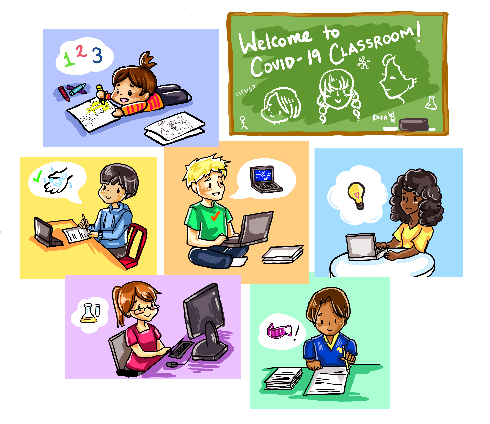
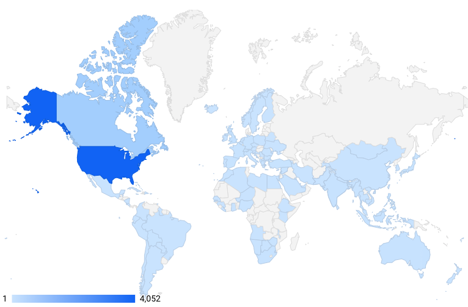

# Welcome to COVID-19 Classroom!

During this global pandemic, everyone is facing questions and uncertainty, including children and adolescents. Sifting through all of the available information and resources to navigate these conversations in effective and age-appropriate ways can feel overwhelming for caregivers and teachers who are facing so many shifting responsibilities. 

As a team of students at Harvard Medical School, we believe it is critical for students of all ages to have access to accurate, engaging, and developmentally-appropriate information about COVID-19 and how it is impacting their lives, as well as resources to help them effectively cope with the stress and anxiety they are likely facing. We have synthesized available information about Coronavirus to craft curricula for elementary, middle, and high school students in formats that are uniquely tailored to each age group’s needs and abilities:

* **Elementary** students will be guided through a series of printable coloring pages.
* **Middle school** students will explore the science behind viruses and the timeline of COVID-19 through videos, readings, and an interactive worksheet.
* **High school and college** students have the opportunity to take part in a virtual case simulation, where they will learn some of the basics of clinical medicine in the context of a patient with COVID-19.

All of the materials published have been reviewed by faculty experts in medicine and child psychiatry and development. We have made every effort to ensure that these curricula will provide age-appropriate, accurate, and empowering information for children and teens, but we advise parents and teachers to review materials first to determine their appropriateness for each individual student. Some students may benefit more from a curriculum outside of their own age group based on developmental and educational progress. Please feel free to share these materials with anyone you think may find them useful! We encourage you to fill out our [guest book](https://forms.gle/zYciv2KbbmJmBN2X8) so that we can see how many students access the site.

As of January 22, 2020, the curriculum has been accessed by over 5,500 users from 111 different countries!

These curricula were entirely written and compiled on a volunteer basis by Harvard Medical School students, and nothing contained on this website is an official publication of the institution. Our materials do not constitute medical advice, and are provided solely as an educational resource.

Please share your [feedback here](https://forms.gle/VV2QKz6WL2WRQ8Bm6).

**The Pediatric Education Team**

**Founder:**  
Rachel Reardon \(**rachel\_reardon@hms.harvard.edu\)**

**Managing Editors:**   
Margaret Irwin \(**margaret\_irwin@hms.harvard.edu**\)  
Priya Shah \(**priya\_shah@hms.harvard.edu**\)

**Young Children Team:**  
Mengting Qiu, Chandler Moore, Toke Odimayomi

**Elementary School Team:**   
Chandler Moore, Logan Beyer, Margaret Irwin

**Middle School Team:**  
Kendall Carpenter, Priya Shah

**High School Team:**  
Jessica Laird, Katie Kester

_Students at Harvard Medical School_  
HMS COVID-19 Student Response Team, [Education for Broader Community](https://covidstudentresponse.org/about/)

**Current Team:   
Managing Editors:** Margaret Irwin, Priya Shah _\(see above for contact information\)_  
**Curriculum Updates:** Allison Fialkowski, Chandler Moore  
**Ethics Module:** Sienna Li  
**Social Justice Module:** Angela Bi  
**Translations:** Brittany Wong, Yurika Kazama

For specific inquiries about a section, additional contact information is provided on the "Start Here" page. 

