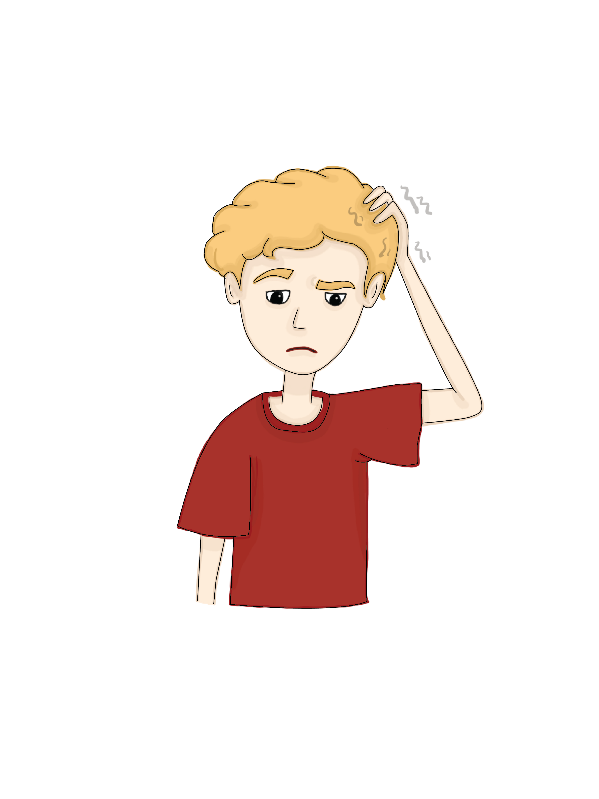

# Grades 1-3

## Before you start, you can click here to print your coloring pages!



## What is happening in the world?

## **Let’s color to learn more!**

## **We have been hearing some BIG news!** 

## **Schools, stores and even parks are being closed because of something called coronavirus.**

## **What is coronavirus?**

## **Coronavirus is a germ that is really small. It makes people sick.**

## **Coronavirus spreads when people are together. When we stay at home, we are staying away from coronavirus. This keeps us all healthy.** 

## **Grown-ups are working really hard to stop coronavirus.**

## **Are you ready to be a germ buster?**

## **Germ busters have 3 jobs!**

### **Job \#1: Wash your hands for 20 seconds. To count to 20 seconds, sing the Happy Birthday song or Baby Shark twice.** 

### **You can watch this video about washing your hands:**



Source: CDC

### **Job \#2: Cover when you Cough or Sneeze.**

### **Job \#3: Send love from a distance. Germs can spread when lots of people are close together.**

  ****

### **We will STOP coronavirus! I am happy I can help keep the virus away from my friends and family.**

## **The End. Thank you for coloring with us! If you want to keep coloring, click** [**HERE**](https://www.coloringforcovid.com/)**!**  

