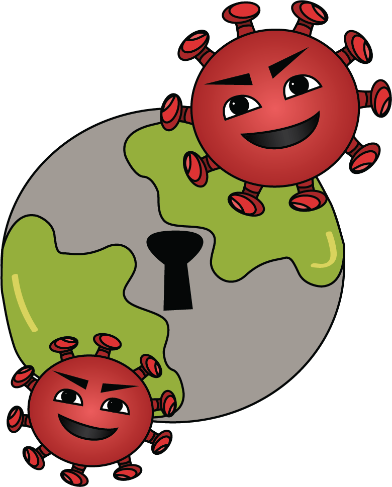

# Module 1: What is Coronavirus?

## **Module 1: What is coronavirus?** 

### **Lately, we have heard a lot of BIG news.**  

### **Schools, parks, and restaurants are closing because of something called Coronavirus.** 

###  **But what exactly is Coronavirus?**

### Coronavirus is a germ that can make people sick. It can spread from person to person. But coronavirus doesn’t have legs, so it likes to travel on tiny drops of water. These water drops can fly in the air when we cough, sneeze, or talk. **If they land on our hands and we touch things, the virus can land on those things and other people might touch them.**

### **Here's a video about droplets:**



Video courtesy of Elena Perez, @elena4prez on Instagram

### Coronavirus can also hide on things we touch like phones, tablets, and toys. Coronavirus is so small that you can’t even see it!

### If coronavirus gets inside a person’s body, it can give them a fever and a cough, and sometimes it can make it feel hard to breathe. Luckily, our body can fight back against coronavirus!

### Inside our bodies, there are special immune cells that travel all around our bodies searching for germs. When they find germs, the immune cells destroy them and keep us healthy! When we feel sick from a cold or flu and then start to feel better, we can thank our immune cells for helping us fight the germs.  ****

### One of the best ways to stop coronavirus is through physical distancing. Physical distancing means staying at home and away from large groups of people. Since coronavirus travels in water droplets, it can only travel a small distance. If we try to stay six feet apart from other people, we can stop the spread of coronavirus.

### Physical distancing is why schools, stores, and movie theaters are closed right now. Let’s stay home to stop Coronavirus. 

### Grown-ups are working together to stop coronavirus and keep everyone healthy. Doctors, nurses, truck drivers, grocery store workers, and even moms and dads are all helping.  ****

### **And YOU can help too! Click on the next lesson to learn how you can be a GERM BUSTER and help fight coronavirus.** 

\*\*\*\*

