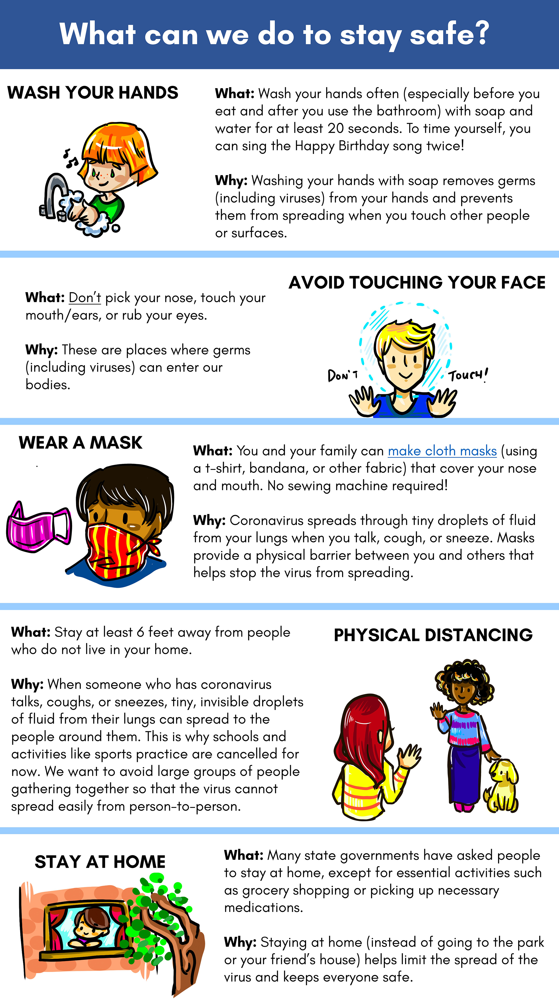

# Part 2: Action and Exploration

### **What can we do to stay safe?**



* **WASH YOUR HANDS**

  * **What:** Wash your hands often \(especially before you eat and after you use the bathroom\) with soap and water for at least 20 seconds. To time yourself, you can sing the Happy Birthday song twice!
  * **Why:** Washing your hands with soap removes germs \(including viruses\) from your hands and prevents them from spreading when you touch other people or surfaces.

  **AVOID TOUCHING YOUR FACE**

  * **What:** Don’t pick your nose, touch your mouth/ears, or rub your eyes. 
  * **Why:** These are places where germs \(including viruses\) can enter our bodies. 

  **WEAR A MASK**

  * **What:** You and your family can [make cloth masks](https://www.youtube.com/watch?v=REtQwwRoxuY) \(using a t-shirt, bandana, or other fabric\) that cover your nose and mouth. No sewing machine required!
  * **Why:** Coronavirus spreads through tiny droplets of fluid from your lungs when you talk, cough, or sneeze. Masks provide a physical barrier between you and others that helps stop the virus from spreading.

  **PHYSICAL DISTANCING**

  * **What:** Stay at least 6 feet away from people who do not live in your home. 
  * **Why:** When someone who has coronavirus talks, coughs, or sneezes, tiny, invisible droplets of fluid from their lungs can spread to the people around them. This is why schools and activities like sports practice are cancelled for now. We want to avoid large groups of people gathering together so that the virus cannot spread easily from person-to-person.

  **STAY AT HOME**

  * **What:** Many state governments have asked people to stay at home, except for essential activities such as grocery shopping or picking up necessary medications. 
  * **Why:** Staying at home \(instead of going to the park or your friend’s house\) helps limit the spread of the virus and keeps everyone safe. 

## **Next steps and scientific discovery**

**What other questions do you have about coronavirus?** 

Scientists have a lot of similar questions! They use a process called the Scientific Method to discover answers to their questions. There are many unknowns, and the Scientific Method helps us deal with the uncertainty by solving problems step-by-step.

**Steps:** 



* **Ask a question.** 
  * Start your question with one of the **5 W’s**: **W**ho, **W**hat, **W**hen, **W**here, **W**hy, or ho**W**?
  * Important criteria for a good question include:
    * Can be researched and tested. 
    * Can be proven one way or the other. 
    * Needs to be complex. Not a yes/no or right/wrong type question.
  * Example: “What medicine can treat coronavirus?”
* **Do background research.** 
  * This means using reliable sources\* to learn more about that topic. Here are some [reliable sources](https://sites.google.com/bostonpublicschools.org/virtuallearningcommons/research-information/research-grades-6-8?authuser=0) that are perfect for middle-schoolers!
  * Example: Read about medicines that are used to treat other viruses, such as the yearly flu. 
* **Create a hypothesis.** 
  * This is what you think the answer is.
  * Example: Our prediction is that flu medication could help people with coronavirus. 
  * Now it’s time to test our idea!
* **Test with an experiment.** 
  * Here comes the creative part – come up with a way to test your hypothesis and see if it is correct.
  * Example: Our experiment is going to test whether flu medication helps people recover from the coronavirus by comparing how sick patients with coronavirus who take flu medication were versus patients who did not take flu medication.
* **Analyze data and draw conclusions.** 
  * Time to figure out what the results of your experiment mean.
  * Example: In our experiment, we found that people who have coronavirus who take flu medicine do not feel less sick and do not get better faster. Thus, our study suggests that flu medication does not help treat people who have coronavirus.
* **Share your results.** 
  * Scientists then share their findings with everyone else so that we all can learn from their work.
  * Example: You could make an online presentation to share with your classmates, teachers, and friends/family.

**Your turn!** Use your worksheet to come up with your own question about coronavirus and work through the scientific process.

**Possible questions include:**

* How does the virus spread to other people?
* Are there long-term effects of the virus on people’s health?
* Why do older people and people with lung/kidney/heart problems get more sick?
  * Think about what you learned at the beginning of this module about the immune system to help you form a hypothesis.
* Come up with your own question; the possibilities are endless!

**\*Reliable Sources:**

1. Government agencies or universities usually use websites that end in .GOV, .EDU, or .ORG.
2. The website will tell you who the author is, so you can check if they're qualified to write about the topic. Usually, qualified authors will have relevant university degrees or job experience that make them experts on a topic.
3. They are evidence-based. This means that the source uses proper scientific methods and data to draw conclusions. The evidence should come from repeated experiments with many people in different places that all come to the same conclusion. It is important to check that the experiments were done correctly and responsibly.
4. The information in the reliable sources will match information from other sources that you already trust, like textbooks.
5. Information will be presented in an unbiased way, meaning that they do not insert their own opinions or exclude certain viewpoints.

## **I’m worried about what this means for me and my friends and family.** 

This is a new and uncertain time for all of us. It is normal to feel worried.

Take a few moments to **write out your feelings** about the virus and physical distancing on your worksheet. How do these changes to your life make you feel? What are you most worried about? What has coronavirus made you realize you miss? You can use sentences, bullet points, pictures, whatever helps you express your feelings -- be creative!

### **I’m worried about my parents or grandparents getting sick.**

In order to avoid older people getting sick, it is important for all of us to do our part by keeping clean and safe. Follow the safety tips we shared to help limit the spread of the disease. Remember that there are a lot of nurses and doctors all across the country and around the world working hard to help everyone stay safe and to help people who are sick get better! 

### **I miss my friends. When will I be able to see them again?** 

It’s hard not to see your friends as often as you usually do. You may miss hanging out with them at each other’s homes, the park, or at school. You will be able to spend time with them as soon as it is safe to do so again. Unfortunately, we do not know exactly when that will be. Which is tough. In the meantime, you can talk on the phone, have video chat hangouts, play online games together, or consider becoming email pen-pals to keep in touch! 

### **When will I go back to school?** 

We do not know when exactly it will be safe for us to resume our normal activities. Once it is safe, schools and businesses will reopen. Until then, there are great websites such as [KhanAcademy](https://www.khanacademy.org/) where you can find videos to learn about new topics.

### **I am feeling worried and/or stressed. What can I do to manage my feelings?** 

It’s normal to feel worried during this time. Taking a break and doing a [4-7-8 breathing exercise](https://www.youtube.com/watch?v=PmBYdfv5RSk) can help you feel more calm. You may also find that talking to your friends or parents, writing a daily journal about your thoughts, or being creative \(such as drawing or painting\) helps calm your mind. Exercising safely away from others \(by walking or running around your neighborhood, or trying yoga or another at-home workout\) can be another great way to manage stress. You can also read about these [Self-Care Tips](https://www.mghclaycenter.org/parenting-concerns/11-self-care-tips-for-teens-and-young-adults/).

Take a few minutes to **develop an action plan** on your worksheet. What helps you feel better when you are stressed? Some ideas could be arts & crafts, dancing, listening to music, or meditation. Make a list of these activities, and you can reference this list when you are feeling uneasy. If you found this activity helpful, you can learn about more stress-reducing strategies in the [Coronavirus Anxiety Workbook](https://thewellnesssociety.org/wp-content/uploads/2020/04/Coronavirus-Anxiety-Workbook.pdf) from The Wellness Society.

