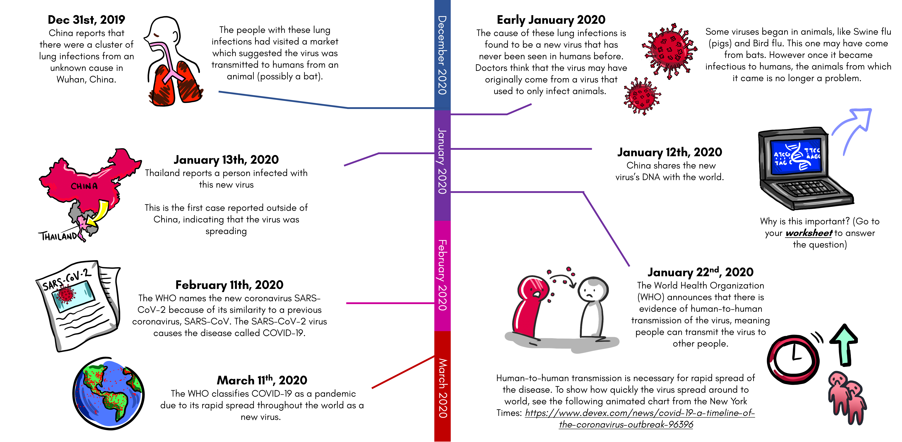

# Part 1: Building Background Knowledge

## **What is a virus? How does it make you sick? How does it spread?**

Please watch the following video to answer these questions and more:



Now that you’ve learned all about viruses, try and **answer the true/false questions** on your worksheet!

If you love science and want to learn more, consider challenging yourself with the Khan Academy “Intro to Viruses” and “Viral Replication” sections. This resource is designed for high schoolers, but we think you can handle it!

\*\*\*\*[**https://www.khanacademy.org/science/high-school-biology/hs-human-body-systems/hs-the-immune-system/a/intro-to-viruses**](https://www.khanacademy.org/science/high-school-biology/hs-human-body-systems/hs-the-immune-system/a/intro-to-viruses)

## **We don’t always get sick from viruses. How does our body fight off viruses?**

**Please watch the following video to learn about our immune system:**



Now that you've learned a little about the immune system’s response to viruses, **complete the matching exercise** on your worksheet to test your knowledge! 

## **What is the new coronavirus?**

 ****Now you know about viruses in general, but what about this new virus?

###  **Let’s learn some terms:**

* **Coronavirus:** a type of virus that has spikes on its membrane, making it look like a crown. “Corona” means crown in Latin! There are other coronaviruses that can cause the common cold.
* **SARS-CoV-2 \(Severe Acute Respiratory Syndrome-Coronavirus-2\):** This is the name of the new virus. Many people just call it the coronavirus. 
* **COVID-19 \(Coronavirus Disease 2019\):** This is the name of the disease caused by SARS-CoV-2.
* **Pandemic:** when a disease spreads to many people across many continents.
  * _How is a pandemic different from other diseases that are spread around the world?_ ****
    * The seasonal flu, which affects many people every year, is not a new disease. We have vaccines to prevent flu and medicines to treat flu. Though the flu can be dangerous, most people are somewhat immune due to past flu exposures.
  * COVID-19 is a pandemic because it is the worldwide spread of a new disease. It seems that a higher percentage of people get more sick from COVID-19 than the flu. Very few or no people are immune because the virus is new. 
  * Remember the video about our immune system? When our bodies see a virus, it creates these antibodies that latch onto the virus and allow our immune cells to kill the virus. These antibodies can protect us in the future if we come in contact with that virus again. We call this immunity. The virus was able to spread so rapidly because no one was immune to it yet. 

##  **What happens when you get COVID-19:**

* **Asymptomatic:** Some people who get infected with the virus never feel sick and might not know that they are infected with the virus. We say that these people are “asymptomatic.” Even though these people don’t feel sick, they can still give the virus to other people who can become sick from it!
* **Mild/moderate:** Some people who get infected will feel sick. They often have a cough, fever, and can be very tired. Less commonly, these people may have a sore throat, runny nose, muscle pain, headaches, nausea, vomiting, and diarrhea.
* **Severe:** Some people who get infected can get very sick from the virus. This can affect their whole body including their lungs, heart, and kidneys. Sometimes they need a machine at the hospital to help them breathe, called a ventilator. The people who are most at risk for these severe complications are older people \(older than 65 years old\), those with previous heart/lung diseases, or other diseases that make them weak such as diabetes or high blood pressure.

###  **What about me?**

* Children are more likely to be asymptomatic or have mild symptoms compared to adults if they get infected with the virus. 
* But if you are infected \(even if you don’t have any symptoms\), the virus can still spread. The good news is that there are awesome safety tips \(discussed below\) that you can use to keep yourself and those you love safe and healthy! 
* You may have heard people talking about children getting “Kawasaki disease” or “MIS-C” after having COVID-19. MIS-C is a very, very rare complication of COVID-19 that happens in a few children. Children with MIS-C can have symptoms such as stomach pain and a rash after getting COVID-19. MIS-C can also affect the heart, and that is why people get scared. Most children, however, recover quickly from COVID-19 and can go back to playing and learning as you normally do. If hearing about MIS-C makes you feel scared or worried, talk to a parent or teacher, so you can learn more

## **So how did this all happen?:**



* **Dec 31st, 2019 -** China reports that there were a cluster of lung infections from an unknown cause in Wuhan, China.
  * The people with these lung infections had visited a market which suggested the virus was transmitted to humans from an animal \(possibly a bat\).
* **Early January 2020 -** The cause of these lung infections is found to be a new virus that has never been seen in humans before. Doctors think that the virus may have originally come from a virus that used to only infect animals. 
  * * Some viruses began in animals, like Swine flu \(pigs\) and Bird flu. This one may have come from bats. However once it became infectious to humans, the animals from which it came is no longer a problem. 
* **January 12th, 2020 -** China shares information about the new virus’s genomic sequence  with the world.
  * * Why is this important? **\(Go to your worksheet to answer the question\)**
* **January 13th, 2020 -** Thailand reports a person infected with this new virus.
  * This is the first case reported outside of China, indicating that the virus was spreading.
* **January 22nd, 2020 -** The World Health Organization \(WHO\) announces that there is evidence of human-to-human transmission of the virus, meaning people can transmit the virus to other people.
  * Human-to-human transmission is necessary for rapid spread of the disease. To show how quickly the virus spread around to world, see the following animated chart from the New York Times: [https://www.devex.com/news/covid-19-a-timeline-of-the-coronavirus-outbreak-96396](https://www.devex.com/news/covid-19-a-timeline-of-the-coronavirus-outbreak-96396)
* **February 11th, 2020 -** The WHO names the new coronavirus SARS-CoV-2 because of its similarity to a previous coronavirus, SARS-CoV. The SARS-CoV-2 virus causes the disease called COVID-19. 
* **March 11th, 2020 -** The WHO classifies COVID-19 as a pandemic due to its rapid spread throughout the world as a new virus. 

