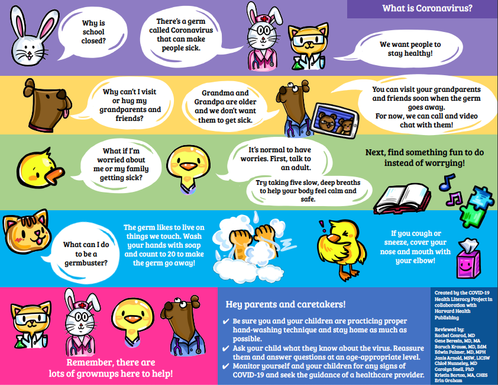

# What should I tell my child about COVID-19?

It’s less about what you say and more about how you say it. What you tell your child will depend on your child’s age and stage, their specific questions, and what they already know about COVID-19. Below are some tips for speaking with your child. For more information, see this [COVID-19 Caregiver/Teacher Guide](https://kids.covidstudentresponse.org/caregiver-guide).  

* Let your child’s questions guide your answers. Try to make sure you know what they are really asking--don’t assume! 
* Be honest, but--especially with young children--don’t provide unnecessary information or too many confusing details.
* Give simple, brief explanations.
* Provide lots of reassurance and highlight the ways that your family is staying safe.
* Highlight actionable ways your child can make positive contributions, such as through hand washing, calling a loved one, completing chores, and modeling good behavior to siblings.
* Here is an [infographic](https://covid19healthliteracyproject.com/#english) about COVID-19 designed for 3-6 year-olds:

\*\*\*\*[**References**](references.md#what-should-i-tell-my-child-about-covid-19)\*\*\*\*

